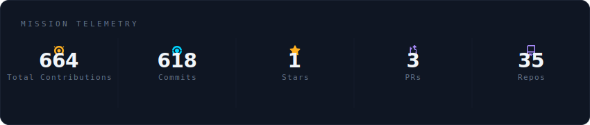

# Hi there, I'm Prajakta Ukirde! 👋

**CSE '27 | Cybersecurity Minor | AI/ML & Full-Stack Developer**

Passionate about building scalable, intelligent, and data-driven systems that solve real-world problems.

## 🌌 My GitHub Galaxy

  

 

  

 

  

 

  

## 🚀 Featured Projects

| Project | Description | Tech Stack |
|---------|-------------|------------|
| **[AgriNLP](https://github.com/prajaktaukirde/AgriNLP)** | sFET - AI agricultural advisory with Fuzzy Logic, RAG, 91.3% accuracy | Python, TensorFlow, RAG, LangChain, React, Node.js |
| **[WebsiteBuilder](https://github.com/prajaktaukirde/WebsiteBuilder)** | Full-stack website builder with modern UI and responsive design | React, Node.js, Express, MongoDB |
| **[ATM-Simulator-System](https://github.com/prajaktaukirde/ATM-Simulator-System)** | Java ATM simulator with secure PIN auth and SQL database | Java, SQL, OOP |

## 📊 GitHub Stats

- **Total Contributions:** 336
- **Commits:** 290
- **Repositories:** 34
- **Pull Requests:** 3
- **Issues:** 9

## 🛠️ Tech Stack

**AI / ML & GenAI:** Python, TensorFlow, RAG, LangChain, Gemini API, Vertex AI, NLP

**MERN Full-Stack:** MongoDB, Express.js, React.js, Node.js, Next.js, TypeScript, Socket.io

**Cloud, Data & Core:** AWS, Google Cloud, Oracle Cloud, Docker, Git & GitHub, Power BI, Tableau, C/C++

## 🔗 Connect With Me

- 📧 Email: prajakta.ukirde@gmail.com
- 💼 LinkedIn: [prajakta-ukirde](https://www.linkedin.com/in/prajakta-ukirde-395862381/)
- 🌐 Portfolio: [prajaktaportfolioo.vercel.app](https://prajaktaportfolioo.vercel.app/)
- 🐙 GitHub: [prajaktaukirde](https://github.com/prajaktaukirde)

## 📁 Other Projects

- [Weather-Dashboard](https://github.com/prajaktaukirde/Weather-Dashboard) - Power BI weather analytics dashboard
- [todo-management-api](https://github.com/prajaktaukirde/todo-management-api) - Backend Todo Management API using NestJS and PostgreSQL
- [healthovia-mini-project](https://github.com/prajaktaukirde/healthovia-mini-project) - Health & wellness web app with BMI calculator
